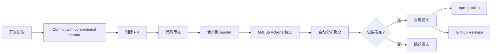

# 自动发版系统

本项目集成了自动化发版系统，支持基于 conventional commits 的版本管理和自动发布。

## 🚀 功能特性

- **自动版本推断**：基于 conventional commits 自动确定版本类型
- **完整的发布流程**：测试 → 构建 → 版本更新 → 发布 → 标签推送
- **GitHub Actions 集成**：合并到 master 分支时自动触发发布
- **多种发布模式**：交互式、非交互式、CI 模式
- **回滚和通知**：失败时自动回滚并创建问题跟踪

## 📋 版本推断规则

脚本会分析提交历史，自动确定版本类型：

| 提交类型 | 版本影响 | 示例 |
|---------|---------|------|
| `feat:` | minor | `0.1.0` → `0.2.0` |
| `fix:` | patch | `0.1.0` → `0.1.1` |
| `BREAKING CHANGE` 或 `feat!:` | major | `0.1.0` → `1.0.0` |
| `perf:`, `revert:` | patch | `0.1.0` → `0.1.1` |
| 其他类型 | 无发布 | 跳过发布 |

## 🛠️ 使用方法

### 手动发布

```bash
# 交互式发布（推荐用于开发环境）
pnpm tsx scripts/release.ts

# 指定版本类型
pnpm tsx scripts/release.ts --version patch

# 自动版本推断
pnpm tsx scripts/release.ts --version auto

# 干运行模式（测试）
pnpm tsx scripts/release.ts --dry-run
```

### 自动发布（GitHub Actions）

自动发布在以下情况触发：

1. **推送到 master 分支**：自动分析提交历史并发布
2. **手动触发**：通过 GitHub Actions 界面手动选择版本类型

#### 跳过自动发布

在提交信息中添加 `[skip release]` 可跳过自动发布：

```bash
git commit -m "docs: update README [skip release]"
```

## ⚙️ 配置说明

### Repository Secrets

需要在 GitHub 仓库设置中配置以下 secrets：

- `NPM_TOKEN`：npm 发布权限 token
- `GITHUB_TOKEN`：自动提供，用于创建 GitHub Release

### npm token 获取

1. 登录 [npmjs.com](https://www.npmjs.com)
2. 进入 Account Settings → Access Tokens
3. 创建 Automation token
4. 在 GitHub 仓库 Settings → Secrets 中添加 `NPM_TOKEN`

## 📊 工作流程

### 开发流程



### 发布流程

1. **预检查**：Git 状态、分支检查、npm 认证、测试、代码检查
2. **版本分析**：解析提交历史，确定版本类型
3. **版本更新**：更新 package.json 版本号
4. **变更日志**：自动生成 CHANGELOG.md
5. **Git 操作**：创建提交和标签
6. **包发布**：发布到 npm registry
7. **GitHub Release**：创建 GitHub Release

## 🔧 CLI 选项

```bash
选项:
  --dry-run            模拟运行，不执行实际操作
  --skip-checks        跳过预检查
  --version <type>     指定版本类型 (patch|minor|major|auto)
  --no-git             跳过 git 操作
  --non-interactive    非交互模式
  --ci                 CI 模式 (自动启用非交互和自动版本推断)
  --check-only         仅检查是否需要发布 (用于 CI)
  --help, -h           显示帮助信息
```

## 🐛 故障排除

### 发布失败

如果自动发布失败，系统会：

1. 自动创建 GitHub Issue 跟踪问题
2. 在 Actions 日志中记录详细错误信息
3. 发送通知给相关人员

### 手动修复

如果需要手动修复发布问题：

```bash
# 检查是否需要发布
pnpm tsx scripts/release.ts --check-only

# 手动发布特定版本
pnpm tsx scripts/release.ts --version patch --ci

# 跳过预检查的紧急发布
pnpm tsx scripts/release.ts --skip-checks --ci
```

### 常见问题

**Q: 提交了 feat 但没有触发发布？**  
A: 检查提交信息是否包含 `[skip release]`，或者查看 Actions 日志确认是否有其他错误。

**Q: 想要强制发布特定版本？**  
A: 使用 GitHub Actions 的手动触发功能，选择所需的版本类型。

**Q: 如何回滚错误的发布？**  
A: 可以手动发布一个新的补丁版本来修复问题，不建议删除已发布的版本。

## 📈 最佳实践

1. **使用 conventional commits**：确保提交信息遵循规范
2. **充分测试**：发布前确保所有测试通过
3. **渐进式发布**：优先使用 patch 和 minor 版本
4. **文档更新**：重要更改及时更新文档
5. **监控发布**：关注发布后的错误和反馈